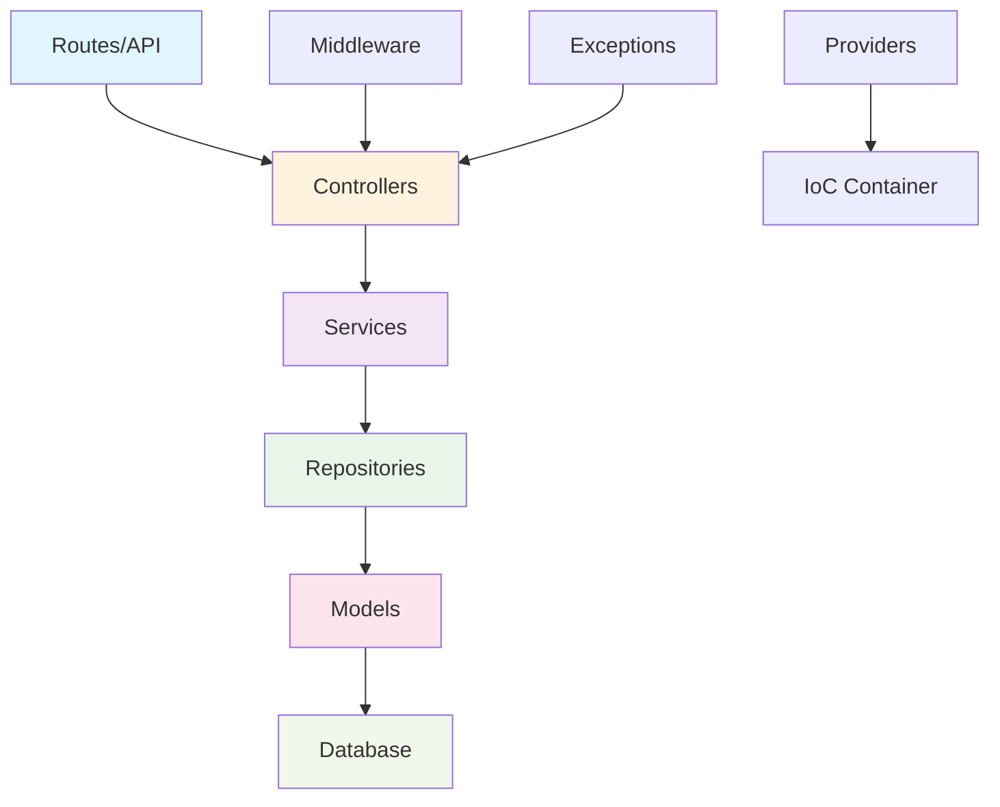

# Diagrama de Clases - Arquitectura PHP

## Diagrama de Clases UML

```mermaid
classDiagram
    %% ============================================================================
    %% CORE FRAMEWORK
    %% ============================================================================
    class Request {
        -method: string
        -path: string
        -query: array
        -post: array
        -headers: array
        +getMethod(): string
        +getPath(): string
        +getQuery(key): mixed
        +getPost(key): mixed
        +getHeader(key): string
    }
    
    class Response {
        -statusCode: int
        -headers: array
        -body: string
        +setStatusCode(code): void
        +setHeader(key, value): void
        +json(data): void
        +send(): void
    }
    
    class Router {
        -routes: array
        +get(path, handler): void
        +post(path, handler): void
        +put(path, handler): void
        +delete(path, handler): void
        +match(method, path): array
    }
    
    class Route {
        -method: string
        -path: string
        -handler: callable
        +match(method, path): bool
        +getHandler(): callable
    }
    
    class Database {
        -connection: PDO
        -dsn: string
        -user: string
        -password: string
        +connect(): PDO
        +query(sql): PDOStatement
        +execute(sql, params): mixed
        +close(): void
    }
    
    class Auth {
        -user: User
        -token: string
        +login(email, password): bool
        +logout(): void
        +check(): bool
        +user(): User
        +hasPermission(code): bool
    }
    
    class Session {
        +start(): void
        +set(key, value): void
        +get(key): mixed
        +has(key): bool
        +destroy(): void
    }
    
    class View {
        -template: string
        -data: array
        +render(template, data): string
        +include(file): void
    }
    
    class Url {
        +route(name, params): string
        +asset(path): string
        +current(): string
    }
    
    class Env {
        -values: array
        +load(): void
        +get(key, default): mixed
    }
    
    %% ============================================================================
    %% MODELOS (Base de Datos)
    %% ============================================================================
    class Model {
        #table: string
        #fillable: array
        #primaryKey: string
        #db: Database
        +find(id): Model
        +all(): array
        +where(column, operator, value): Model
        +create(data): bool
        +update(data): bool
        +delete(): bool
        +save(): bool
    }
    
    class UserModel extends Model {
        -id: int
        -nombre: string
        -email: string
        -password_hash: string
        -habilitado: bool
        +getRoles(): array
        +getPermissions(): array
        +getOficinas(): array
        +hasPermission(code): bool
    }
    
    class MaterialModel extends Model {
        -id: int
        -codigo: string
        -descripcion: string
        -id_categoria: int
        -id_marca: int
        -id_unidad: int
        -habilitado: bool
        +getCategoria(): CategoriaModel
        +getMarca(): MarcaModel
        +getUnidad(): UnidadModel
        +getStock(): array
    }
    
    class StockModel extends Model {
        -id: int
        -id_material: int
        -id_ubicacion: int
        -cantidad_actual: int
        -stock_minimo: int
        -estado: string
        -habilitado: bool
        +getMaterial(): MaterialModel
        +getUbicacion(): UbicacionModel
        +ajustar(cantidad): void
        +estado(): string
    }
    
    class SolicitudModel extends Model {
        -id: int
        -codigo: string
        -fecha: string
        -fecha_aprobacion: string
        -id_tipo_sol: int
        -id_proveedor: int
        -estado: string
        -origen: string
        +getDetalles(): array
        +getSolicitante(): UserModel
        +getAprobador(): UserModel
        +getMaterial(): MaterialModel
        +aprobar(): void
        +rechazar(): void
    }
    
    class UbicacionModel extends Model {
        -id: int
        -id_oficina: int
        -id_almacen: int
        -nombre: string
        -habilitado: bool
        +getOficina(): OficinaModel
        +getAlmacen(): AlmacenModel
        +getStock(): array
    }
    
    class OficinaModel extends Model {
        -id: int
        -codigo: string
        -nombre: string
        -numero_pisos: int
        -direccion: string
        -habilitado: bool
        +getUbicaciones(): array
    }
    
    class RoleModel extends Model {
        -id: int
        -codigo: string
        -nombre: string
        -descripcion: string
        -habilitado: bool
        +getPermisos(): array
    }
    
    class PermissionModel extends Model {
        -id: int
        -codigo: string
        -nombre: string
        -modulo: string
        -habilitado: bool
        +getRoles(): array
    }
    
    class CategoriaModel extends Model {
        -id: int
        -nombre: string
        -habilitado: bool
        +getMateriales(): array
    }
    
    class MarcaModel extends Model {
        -id: int
        -nombre: string
        -habilitado: bool
        +getMateriales(): array
    }
    
    class UnidadModel extends Model {
        -id: int
        -nombre: string
        -habilitado: bool
        +getMateriales(): array
    }
    
    class ProveedorModel extends Model {
        -id: int
        -ruc: string
        -razon_social: string
        -telefono: string
        -direccion: string
        -habilitado: bool
    }
    
    class MovimientoModel extends Model {
        -id: int
        -codigo: string
        -id_stock: int
        -id_detalle: int
        -estado: string
        -fecha: string
        +getStock(): StockModel
        +getDetalle(): DetalleModel
        +realizar(): void
    }
    
    class InventarioModel extends Model {
        +getInventarioCompleto(): array
        +getInventarioPorOficina(oficina_id): array
        +getInventarioBajo(): array
        +getHistorialMovimientos(stock_id): array
    }
    
    %% ============================================================================
    %% REPOSITORIES (Acceso a Datos)
    %% ============================================================================
    class Repository {
        #db: Database
        #table: string
        +find(id): mixed
        +all(): array
        +findBy(column, value): mixed
        +create(data): mixed
        +update(id, data): bool
        +delete(id): bool
    }
    
    class UserRepository extends Repository {
        +findByEmail(email): UserModel
        +findWithRoles(id): UserModel
        +getRoles(user_id): array
        +getPermissions(user_id): array
    }
    
    class MaterialRepository extends Repository {
        +findByCodigo(codigo): MaterialModel
        +getActivos(): array
        +getConStockBajo(): array
    }
    
    class StockRepository extends Repository {
        +getStockPorMaterial(material_id): array
        +getStockPorUbicacion(ubicacion_id): array
        +getEstadisticas(): array
    }
    
    class SolicitudRepository extends Repository {
        +getPendientes(): array
        +getAprobadas(): array
        +getRechazadas(): array
        +getPorUsuario(user_id): array
    }
    
    class InventarioRepository extends Repository {
        +getInventarioCompleto(filtros): array
        +getResumenPorOficina(): array
        +getStockBajo(): array
    }
    
    class OficinaRepository extends Repository {
        +getActivas(): array
        +getConUbicaciones(): array
    }
    
    class UbicacionRepository extends Repository {
        +getPorOficina(oficina_id): array
    }
    
    class RegistroMaterialRepository extends Repository {
        +getPendientes(): array
        +getAtendidas(): array
        +getRechazadas(): array
    }
    
    class CatalogoRepository extends Repository {
        +getCategorias(): array
        +getMarcas(): array
        +getUnidades(): array
    }
    
    class ProveedorRepository extends Repository {
        +getActivos(): array
    }
    
    %% ============================================================================
    %% SERVICIOS (Lógica de Negocio)
    %% ============================================================================
    class Service {
        #repository: Repository
        +__construct(repo): void
    }
    
    class SolicitudCreadorService extends Service {
        +crearEntrada(data): Solicitud
        +crearSalida(data): Solicitud
        +validar(data): bool
        -generarCodigo(): string
    }
    
    class SolicitudDecisionService extends Service {
        +aprobar(solicitud_id, user_id): void
        +rechazar(solicitud_id, user_id): void
        -crearMovimientos(solicitud_id): void
        -actualizarStock(movimiento): void
    }
    
    class SolicitudEntradaService extends Service {
        +procesarEntrada(solicitud_id): void
        +validarProveedor(proveedor_id): bool
    }
    
    class StockAjusteService extends Service {
        +ajustar(stock_id, cantidad): void
        +validarCantidad(cantidad): bool
    }
    
    class StockManualService extends Service {
        +crearAjusteManual(data): Solicitud
        +aplicarAjuste(solicitud_id): void
    }
    
    class RegistroMaterialCreadorService extends Service {
        +crearRegistro(data): RegistroMaterial
        +validar(data): bool
    }
    
    class RegistroMaterialDecisionService extends Service {
        +atender(registro_id, material_data): void
        +rechazar(registro_id): void
    }
    
    %% ============================================================================
    %% CONTROLADORES
    %% ============================================================================
    class Controller {
        #auth: Auth
        #response: Response
        #view: View
        +__construct(auth, response, view): void
        +authorize(permission): void
    }
    
    class HomeController extends Controller {
        +index(): void
    }
    
    class AdminController extends Controller {
        +dashboard(): void
        +usuarios(): void
        +roles(): void
    }
    
    class InventarioController extends Controller {
        -inventarioRepo: InventarioRepository
        +index(): void
        +buscar(): void
        +detalles(material_id): void
        +ajusteManual(): void
    }
    
    class SolicitudesController extends Controller {
        -solicitudCreador: SolicitudCreadorService
        -solicitudDecision: SolicitudDecisionService
        +crearEntrada(): void
        +crearSalida(): void
        +pendientes(): void
        +aprobar(solicitud_id): void
        +rechazar(solicitud_id): void
    }
    
    class RegistroMaterialController extends Controller {
        -registroCreador: RegistroMaterialCreadorService
        -registroDecision: RegistroMaterialDecisionService
        +pedir(): void
        +misPedidos(): void
        +pendientes(): void
        +atender(registro_id): void
    }
    
    class AuthController extends Controller {
        -userRepo: UserRepository
        +login(): void
        +logout(): void
        +verificar(): void
    }
    
    %% ============================================================================
    %% PROVIDERS (Inyección de Dependencias)
    %% ============================================================================
    class ServiceProvider {
        +register(): void
        +boot(): void
    }
    
    class AppServiceProvider extends ServiceProvider {
        +register(): void
    }
    
    class AuthServiceProvider extends ServiceProvider {
        +register(): void
        +bootAuthorizacion(): void
    }
    
    class InventarioServiceProvider extends ServiceProvider {
        +register(): void
        +registrarServicios(): void
    }
    
    %% ============================================================================
    %% RELACIONES
    %% ============================================================================
    
    %% Database connections
    Router --> Request
    Router --> Response
    Router --> Controller
    Controller --> Response
    Controller --> View
    Controller --> Auth
    
    %% Auth
    Auth --> UserModel
    Auth --> Session
    
    %% Repositories
    Repository --> Database
    UserRepository --> UserModel
    MaterialRepository --> MaterialModel
    StockRepository --> StockModel
    SolicitudRepository --> SolicitudModel
    InventarioRepository --> InventarioModel
    
    %% Services
    Service --> Repository
    SolicitudCreadorService --> SolicitudRepository
    SolicitudDecisionService --> SolicitudRepository
    SolicitudDecisionService --> StockRepository
    SolicitudDecisionService --> MovimientoModel
    StockAjusteService --> StockRepository
    StockManualService --> StockRepository
    
    %% Controllers
    Controller --> Service
    InventarioController --> InventarioRepository
    SolicitudesController --> SolicitudCreadorService
    SolicitudesController --> SolicitudDecisionService
    RegistroMaterialController --> RegistroMaterialCreadorService
    RegistroMaterialController --> RegistroMaterialDecisionService
    
    %% Model relationships
    SolicitudModel --> UserModel
    SolicitudModel --> MaterialModel
    MaterialModel --> CategoriaModel
    MaterialModel --> MarcaModel
    MaterialModel --> UnidadModel
    StockModel --> MaterialModel
    StockModel --> UbicacionModel
    UbicacionModel --> OficinaModel
    UserModel --> RoleModel
    RoleModel --> PermissionModel
    MovimientoModel --> StockModel
```



---

## Arquitectura en Capas



---

## Descripción de Componentes

### 🔷 Core Framework
- **Request**: Encapsula la solicitud HTTP
- **Response**: Encapsula la respuesta HTTP
- **Router**: Enrutador de aplicación
- **Database**: Conexión a BD
- **Auth**: Autenticación y autorización
- **Session**: Gestión de sesiones
- **View**: Motor de plantillas
- **Url**: Generador de URLs
- **Env**: Variables de entorno

### 🔶 Modelos (Representan Entidades BD)
- **UserModel**: Usuario del sistema
- **MaterialModel**: Artículo de catálogo
- **StockModel**: Inventario en ubicación
- **SolicitudModel**: Solicitud entrada/salida
- **UbicacionModel**: Lugar de almacenamiento
- **OficinaModel**: Sucursal
- **RoleModel**: Rol del sistema
- **PermissionModel**: Permiso del sistema
- **MovimientoModel**: Movimiento de stock
- **InventarioModel**: Vista del inventario completo

### 🟣 Repositorios (Acceso a Datos)
- Patrón Repository: abstrae acceso a BD
- Métodos CRUD genéricos
- Consultas específicas del dominio
- Ej: `UserRepository.findByEmail()`, `MaterialRepository.getConStockBajo()`

### 🔵 Servicios (Lógica de Negocio)
- **SolicitudCreadorService**: Crear solicitudes (entrada/salida)
- **SolicitudDecisionService**: Aprobar/rechazar solicitudes
- **SolicitudEntradaService**: Procesar entrada de stock
- **StockAjusteService**: Ajustar stock
- **StockManualService**: Ajustes manuales desde admin
- **RegistroMaterialCreadorService**: Crear registro de material nuevo
- **RegistroMaterialDecisionService**: Atender/rechazar registro

### 🟠 Controladores (Puntos de Entrada)
- **AdminController**: Gestión admin (usuarios, roles)
- **InventarioController**: Consultas de inventario
- **SolicitudesController**: Gestión de solicitudes
- **RegistroMaterialController**: Gestión de registro de materiales
- **AuthController**: Autenticación

### 🟡 Providers (Inyección de Dependencias)
- **AppServiceProvider**: Servicios generales
- **AuthServiceProvider**: Autenticación y autorización
- **InventarioServiceProvider**: Servicios de inventario

---

## Flujos de Interacción

### 1. Crear Solicitud de Entrada
```
SolicitudesController.crearEntrada()
    ↓
SolicitudCreadorService.crearEntrada()
    ↓
SolicitudRepository.create()
    ↓
SolicitudModel.save()
    ↓
Database.execute()
```

### 2. Aprobar Solicitud
```
SolicitudesController.aprobar()
    ↓
SolicitudDecisionService.aprobar()
    ├─ SolicitudRepository.update() → estado = 'Aprobada'
    ├─ crearMovimientos()
    │   ↓
    │   MovimientoModel.create()
    │   StockModel.update() → cantidad_actual (trigger calcula estado)
    └─ AuthUser como aprobador
```

### 3. Consultar Inventario
```
InventarioController.index()
    ↓
InventarioRepository.getInventarioCompleto()
    ↓
SELECT * FROM v_inventario_completo (Vista DB)
    ↓
Response.json(inventario)
```

### 4. Ajuste Manual de Stock
```
InventarioController.ajusteManual()
    ↓
StockManualService.crearAjusteManual()
    ├─ SolicitudModel.create() (origen='manual')
    └─ SolicitudDecisionService.aprobar()
        ↓
        StockModel.update() (cantidad)
```

---

## Convenciones de Código

### Nombres de Tablas
- Prefijo: `t_` (ej: `t_usuario`, `t_material`)
- Minúsculas con guiones bajos
- Singular o plural según contexto

### Nombres de Columnas
- Minúsculas con guiones bajos
- FK: `id_<tabla>` (ej: `id_material`, `id_oficina`)
- Booleano: `habilitado`
- Timestamps: `created_at`, `updated_at`

### Nombres de Clases
- PascalCase
- Modelos: `<Nombre>Model`
- Repositories: `<Nombre>Repository`
- Controllers: `<Nombre>Controller`
- Services: `<Nombre>Service`

### Métodos
- camelCase
- Prefijo get/is/has para getters
- Prefijo create/update/delete para mutadores

